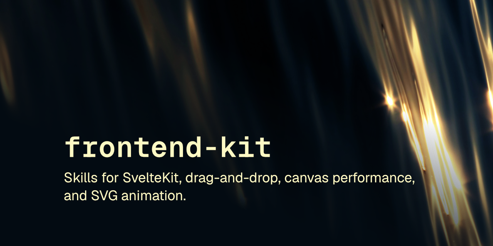

# frontend-kit

4 skills: SvelteKit, canvas, drag-drop, SVG anim. Build UI right first try.

<br clear="left"/>

[](LICENSE) [](https://skills.sh/robcsaszar/frontend-kit)

Frontend implementation and review skills for canvas, drag-and-drop, Svelte 5 / SvelteKit, and SVG animation work.

These skills follow the [Agent Skills specification](https://agentskills.io/specification) so they can be used by any skills-compatible agent.

## Installation

### npx skills

```
npx skills add robcsaszar/frontend-kit
```

### Marketplace

```
/plugin marketplace add robcsaszar/frontend-kit
/plugin install robcsaszar-frontend-kit@frontend-kit
```

### Manually

Copy the `skills/` directory into your project's `.claude/skills/`.

## Installing a single skill

```
npx skills add robcsaszar/frontend-kit --skill with-canvas
```

Or manually copy just that skill's directory.

## Skills

| Skill | Description |
|-------|-------------|
| [with-canvas](skills/with-canvas) | Canvas implementation and review guidance for vanilla JS/TS, Web Workers, OffscreenCanvas, and libraries such as Konva, p5.js, Paper.js, and Three.js |
| [with-drag-drop](skills/with-drag-drop) | Guidance for building drag-and-drop from scratch: free-dragging, sortable lists, resizable panels, and drop zones, no third-party dependency required |
| [with-svelte](skills/with-svelte) | Modern Svelte 5 and SvelteKit guidance: runes, template directives, routing, data flow, remote functions, and deployment |
| [with-svg-animation](skills/with-svg-animation) | Guidance on performant SVG animation: stroke draw effects, path morphing, clip-path animation, and choosing between CSS, GSAP, and anime.js |

## License

[MIT](LICENSE) © Rob Csaszar
